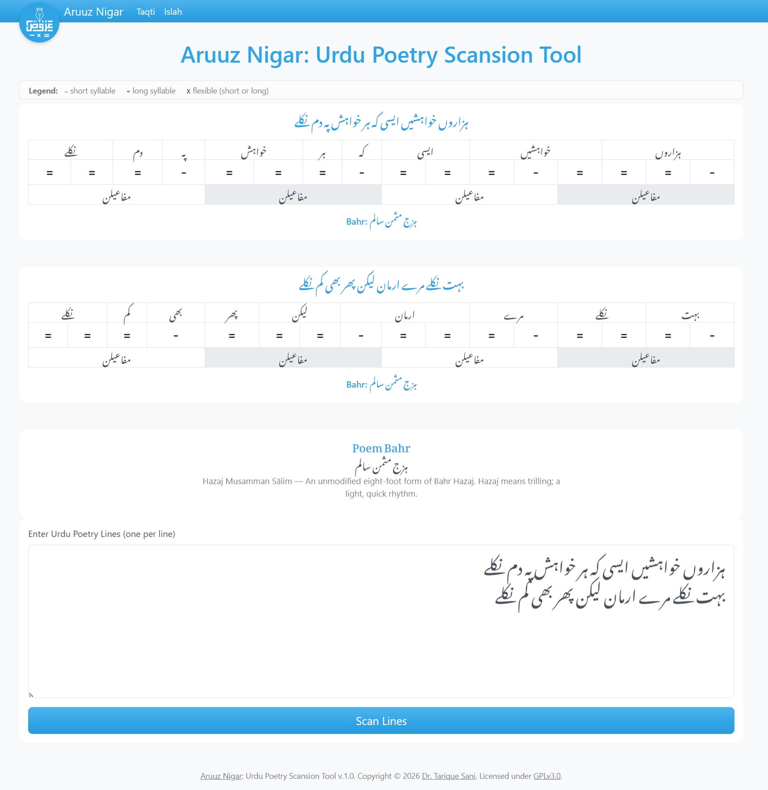

# Aruuz Nigar - Urdu Poetry Scansion Tool

## What is Aruuz Nigar?

Aruuz Nigar is an Urdu poetry tool that helps poets and readers work with **arūz** and **ghazal rhyme**. For meter, it infers the taqti of individual lines and matches them against known **bahrs**. For ghazals, it can check **radeef** and **kafiya** (strict Urdu-script radeef detection, kafiya consistency against the matla, plus phonetic hints where applicable). It also ships with a **basic kafiya dictionary**: look up an Urdu word and browse rhyming words grouped by match quality. An **MCP server** exposes the same scansion and analysis capabilities to compatible AI assistants and editors.

The project has two parts: **Aruuz**, a reusable Python library (scansion, meter matching, and rhyme utilities), and **Nigar**, a Flask-based web frontend that exposes scansion, islah-style radeef/kafiya feedback, and the dictionary UI. Here is how it looks...




## Why create Aruuz Nigar?

Aruuz Nigar was created for my understanding of Urdu arūz. While tools such as Rekhta's taqti and Aruuz.com are available, Rekhta is proprietary and the publicly available Aruuz.com codebase is more than a decade old, written in C#. Aruuz Nigar aims to provide a modern, open source, developer friendly alternative with a clear semantic core that can run on both desktops and servers.

## How to use Aruuz Nigar?

### Download for Windows end-users

Download the executable from [**HERE**](https://github.com/tariquesani/aruuz-nigar/releases){target="_blank"}. Save and double-click `aruuznigar.exe`. It starts the web UI and the MCP server together, then opens your browser. If it does not, open `http://127.0.0.1:5000` manually. **No install, setup, or Python needed.**

**Note**: The executable runs locally: Flask on port **5000** (web UI and API) and the MCP server on port **8765** (SSE at `http://127.0.0.1:8765/sse`). All processing stays on your machine; no external network access is required for normal use. To connect a compatible AI assistant, point it at that MCP endpoint (some releases also include a `.mcpb` bundle for tools such as Claude Desktop).

### For everyone else

**Installation:**
   **Clone the repository:**
   ```bash
   git clone https://github.com/tariquesani/aruuz-nigar.git
   cd aruuz-nigar/
   ```

  **Setup Virtual Environment**

   **Windows:**
   ```bash
   python -m venv venv
   venv\Scripts\activate
   pip install --upgrade pip
   pip install -e .
   pip install -r requirements.txt
   ```

   **Linux/Mac:**

   ```bash
   python3 -m venv venv
   source venv/bin/activate
   pip install --upgrade pip
   pip install -e .
   pip install -r requirements.txt
   ```

  **Run Aruuz Nigar (web + MCP):**

   ```bash
   python launcher.py
   ```
   This starts the Flask app at `http://127.0.0.1:5000` and the MCP server at `http://127.0.0.1:8765/sse` (same behavior as the Windows executable).

   For development you can run services separately: `python app.py` for the web UI only, and `python mcp/aruuznigar.py` for MCP after Flask is up. See `mcp/README.md` for the FastMCP dev inspector workflow.

  **Docker (optional):**

   ```bash
   docker compose up -d
   ```
   Web UI: `http://<host>:5000`, MCP: `http://<host>:8765/sse`

  **For developers, use as a Python library (Aruuz):**

   ```python

   from aruuz.scansion import Scansion
   from aruuz.models import Lines

   scanner = Scansion()
   line = Lines("نقش فریادی ہے کس کی شوخیِ تحریر کا")
   scanner.add_line(line)
   results = scanner.scan_lines()

   ```

## Project Structure

- `aruuz/` — Core Python library (scansion, meters, rhyme, trees)
  - `scansion/` — Scansion engine (`core.py`, word analysis/assignment, length scanners, meter matching, prosodic rules, scoring, `explanation_builder.py`)
  - `tree/` — Pattern matching (`code_tree.py`, `pattern_tree.py`, `state_machine.py`)
  - `database/` — Word lookup and metadata (`word_lookup.py`, `word_metadata.json`, `word_vazn_metadata.json`; `aruuz_nigar.db` and `kafiya_index.pkl` are built or supplied at runtime)
  - `rhyme/` — Ghazal rhyme (`radeef.py`, `kafiya.py`, `kafiya_dict.py`, `text_utils.py`)
  - `utils/` — Text/diacritics, logging, alignment (`text.py`, `araab.py`, `aligner.py`, `meter_align.py`, `meter_summaries.py`, `logging_config.py`)
  - `meters.py`, `models.py` — Bahr definitions and data models
- `app.py` — Flask application (Nigar web UI and `/api` routes)
- `launcher.py` — Starts Flask + MCP together (used by `aruuznigar.exe` and recommended for local runs)
- `serve_flask_mcp.py` — Alternate subprocess launcher for Flask + MCP
- `mcp/` — MCP server (`aruuznigar.py`) for AI tool integration; see `mcp/README.md`
- `web/` — Frontend
  - `templates/` — `index.html` (scansion), `islah.html`, `kafiya.html` (qafiya dictionary UI)
  - `api/` — JSON handlers (`scan.py`, `islah.py`, `meter_dominant.py`, `meter_distance.py`, `radeefkafiya.py`; discovery-based routing)
  - `static/` — CSS, JS, fonts, images
- `scripts/` — CLI and maintenance tools
  - Scansion: `scan_poetry.py`, `scan_word.py`, `show_tree.py`
  - Rhyme/qafiya: `check_kafiya.py`, `check_radeef.py`, `get_kafiya.py`, `build_words_index.py`
  - Metadata: `build_word_metadata_json.py`, `build_word_vazn_json.py`
- `tests/` — `test_canonical_sher_to_bahr_mapping.py`, `test_aligner.py`, `legacy/` (older suites)
- `docs/` — MkDocs site (`index.md`, `CHANGELOG.md`, `guides/`, `api/openapi.yml`)
- `docker-compose.yml`, `Dockerfile.main`, `Dockerfile.release` — Container deployment
- `aruuznigar.spec` — PyInstaller spec for Windows `aruuznigar.exe`
- `setup.py`, `requirements.txt` — Package install and dependencies


## Notes

Word-level scansion intentionally over-generates. Canonical selection happens at line/meter level.

## Attribution

Based on the original [Aruuz](https://github.com/sayedzeeshan/Aruuz) by [Sayed Zeeshan Asghar](https://github.com/sayedzeeshan) (thank you!)

Urdu word list for the kafiya dictionary index: [urduhack/urdu-words](https://github.com/urduhack/urdu-words).

Original: GPL-2.0 licensed  
Aruuz Nigar Python port: GPL-3.0 licensed  
Ported by Dr. Tarique Sani, 2026

## Status

**In Development** 
- Works well for regular meters (bahr)
- Will work with some caveats for bahr-e-hindi and bahr-e-zamzama
- Does not support Rubai well

**Bug Reports and Feedback very welcome**

Aruuz Nigar is under active development, and bugs or incorrect scansion results are expected.
If you encounter issues, please report them using [GitHub Issues](https://github.com/tariquesani/aruuz-nigar/issues).

## Documentation
The core Python library (`aruuz/`) is extensively documented using module-level docstrings and inline explanations for all public classes and functions. These docstrings describe the intended behavior, inputs, outputs, and design rationale of the scansion engine, meter matching, tree traversal, scoring, rhyme (radeef/kafiya), kafiya dictionary lookup, and utility modules.

The existing source documentation is suitable for automatic API documentation generation using tools such as Sphinx or similar docstring-based systems. Generated API documentation is not published yet and will be added once the public interfaces stabilize further.


## License

GPL V3.0, See [LICENSE](./LICENSE) file in parent directory.
